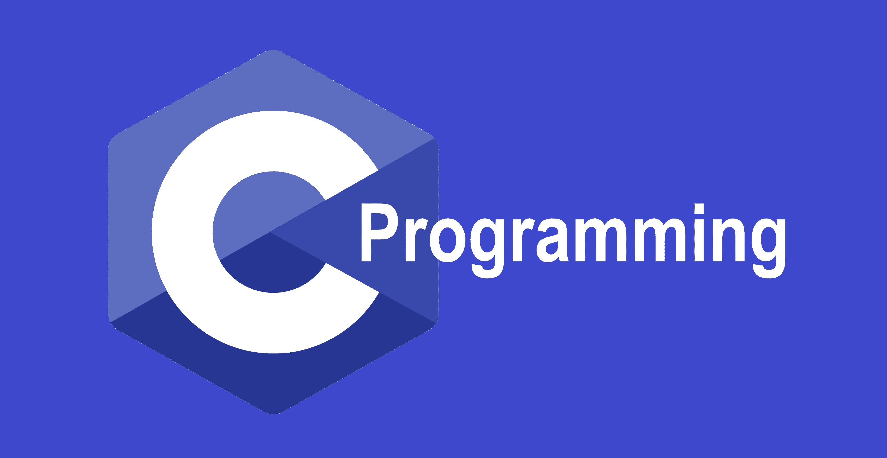

# C_Programming_Language

C programming is a general-purpose, procedural, imperative computer programming language developed in 1972 by Dennis M. Ritchie at the Bell Telephone Laboratories to develop the UNIX operating system. C is the most widely used computer language. It keeps fluctuating at number one scale of popularity along with Java programming language, which is also equally popular and most widely used among modern software programmers.

## Introduction

### Facts about C

    #### C was invented to write an operating system called UNIX
  
    #### C is a successor of B language which was introduced around the early 1970s
  
    #### The language was formalized in 1988 by the American National Standard Institute (ANSI)
  
    #### The UNIX OS was totally written in C
  
    #### Today C is the most widely used and popular System Programming Language
  
    #### Most of the state-of-the-art software have been implemented using C
   
### Applications of C Programming

    #### Operating Systems
    
    #### Language Compilers
    
    #### Assemblers
    
    #### Text Editors
    
    #### Print Spoolers
    
    #### Network Drivers
    
    #### Modern Programs
    
    #### Databases
    
    #### Language Interpreters
    
    #### Utilities

## Documentation

    #### C language： https://en.cppreference.com/w/c/language
    
    
    
